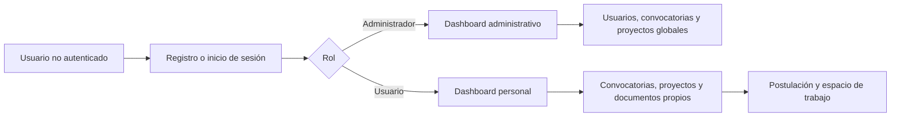

# Flujo base de ProjectHub

Esta guía describe cómo levantar el proyecto en desarrollo y el flujo funcional principal de la aplicación.

## Componentes

- `frontend/`: aplicación Vue 3 que se abre en el navegador.
- `backend/`: API Flask y conexión a PostgreSQL.
- `backend/seed/`: carga de datos de demostración a través de los endpoints de la API.
- `database/` y `backend/migrations/`: definición y evolución de la base de datos.

## Flujo funcional



### Usuario administrador

El administrador tiene acceso a la administración global:

- Consulta y gestiona usuarios.
- Crea, actualiza y elimina convocatorias.
- Añade requisitos a convocatorias y revisa sus postulaciones.
- Consulta todos los proyectos, documentos e historial de actividad.
- Su dashboard muestra usuarios, convocatorias vigentes, proyectos y postulaciones recibidas.

### Usuario regular

El usuario regular trabaja con su propia información:

- Consulta convocatorias vigentes y puede inscribirse.
- Trabaja en el espacio de una convocatoria: requisitos, proyecto, documentos y seguimiento.
- Consulta y gestiona únicamente sus proyectos y documentos.
- Su dashboard muestra sus proyectos, convocatorias vigentes, proyectos en revisión y documentos cargados.

## Requisitos locales

- Python 3.12 o superior.
- Node.js LTS y npm.
- PostgreSQL 13 o superior, o Docker Desktop para usar el servicio definido en `docker-compose.yml`.

Configura las variables de entorno requeridas por el backend antes de iniciar el servidor. La aplicación carga el archivo `.env` desde `backend/`.

## Primera instalación

Desde la raíz del repositorio:

```powershell
# Base de datos opcional mediante Docker
docker compose up -d postgres

# Backend
cd backend
py -m venv venv
.\venv\Scripts\Activate.ps1
py -m pip install -r requirements.txt

# Frontend: abrir otra terminal desde la raíz
cd frontend
npm install
```

Si PowerShell no permite activar scripts, usa una sesión con permisos de ejecución adecuados o activa el entorno desde `cmd` con `venv\Scripts\activate.bat`.

## Ejecutar en desarrollo

Se requieren dos terminales: una para el backend y otra para el frontend.

### Terminal 1: backend

```powershell
cd backend
.\venv\Scripts\Activate.ps1
py -m flask --app factory.py run --debug
```

La API se inicia normalmente en `http://127.0.0.1:5000` y sus endpoints están bajo el prefijo `/api/v1`.

### Terminal 2: frontend

```powershell
cd frontend
npm run dev
```

Abre la URL que indique Vite en la terminal, normalmente `http://localhost:5173`.

## Ejecutar la seed de demostración

La seed consume la API por HTTP; por eso el backend debe estar encendido antes de ejecutarla.

1. En la primera terminal, inicia el backend y mantenlo ejecutándose:

   ```powershell
   cd backend
   .\venv\Scripts\Activate.ps1
   py -m flask --app factory.py run --debug
   ```

2. Abre una segunda terminal, activa el mismo entorno virtual y ejecuta la seed:

   ```powershell
   cd backend
   .\venv\Scripts\Activate.ps1
   py seed/run_seed.py
   ```

La seed crea o actualiza el usuario administrador, usuarios de demostración, convocatorias, requisitos, postulaciones, proyectos y documentos de prueba mediante los endpoints disponibles.

No ejecutes la seed con el servidor detenido: no puede insertar directamente en la base de datos y fallará al no poder comunicarse con `http://localhost:5000/api/v1`.

## Caché del frontend

Los módulos de usuarios y convocatorias conservan datos en `localStorage` para mostrar contenido rápidamente. Al entrar en esos módulos, ahora se revalidan contra la API, por lo que los datos generados por una seed o por otra sesión se actualizan sin tener que borrar manualmente la caché del navegador.

Al cerrar sesión, se limpian las claves de caché que comienzan con `projecthub.` para evitar que información de una cuenta se muestre en otra.

## Comandos útiles

```powershell
# Ejecutar migraciones desde backend, con el entorno virtual activo
py -m flask --app factory.py db upgrade

# Validar el tipado del frontend
cd frontend
npx.cmd vue-tsc --noEmit -p tsconfig.app.json
```

## Rutas principales del frontend

| Ruta | Uso |
| --- | --- |
| `/login` | Inicio de sesión |
| `/register` | Registro público |
| `/dashboard` | Dashboard según el rol autenticado |
| `/users` | Gestión de usuarios (solo administrador) |
| `/calls` | Listado de convocatorias |
| `/projects` | Listado de proyectos según permisos |
| `/documents` | Documentos disponibles para el usuario |
| `/history` | Historial global para admin o propio para usuario |
| `/profile` | Perfil del usuario autenticado |
